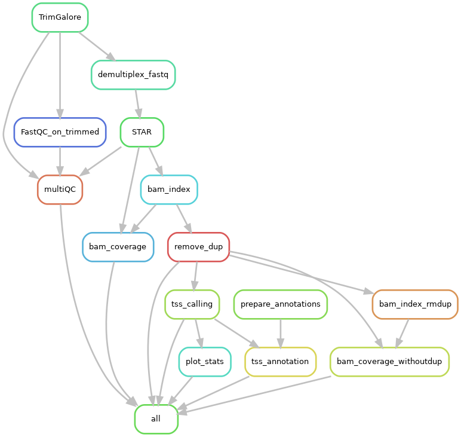

# CAGE pipeline
Snakemake pipeline for CAGE data analysis using STAR/Subread, deeptools and icetea

**Authors : Jana Bohem and Vivek Bhardwaj**

## How to run

Use the following command to run the workflow on the cluster:

```
snakemake -s ~/programs/cage_pipeline/Snakefile --configfile \
example_config.yml -c "SlurmEasy -n {rule} -t {threads}" \
--jobs 20 --latency-wait 100
```

## Analysis steps

Currently the workflow performs the following steps.


